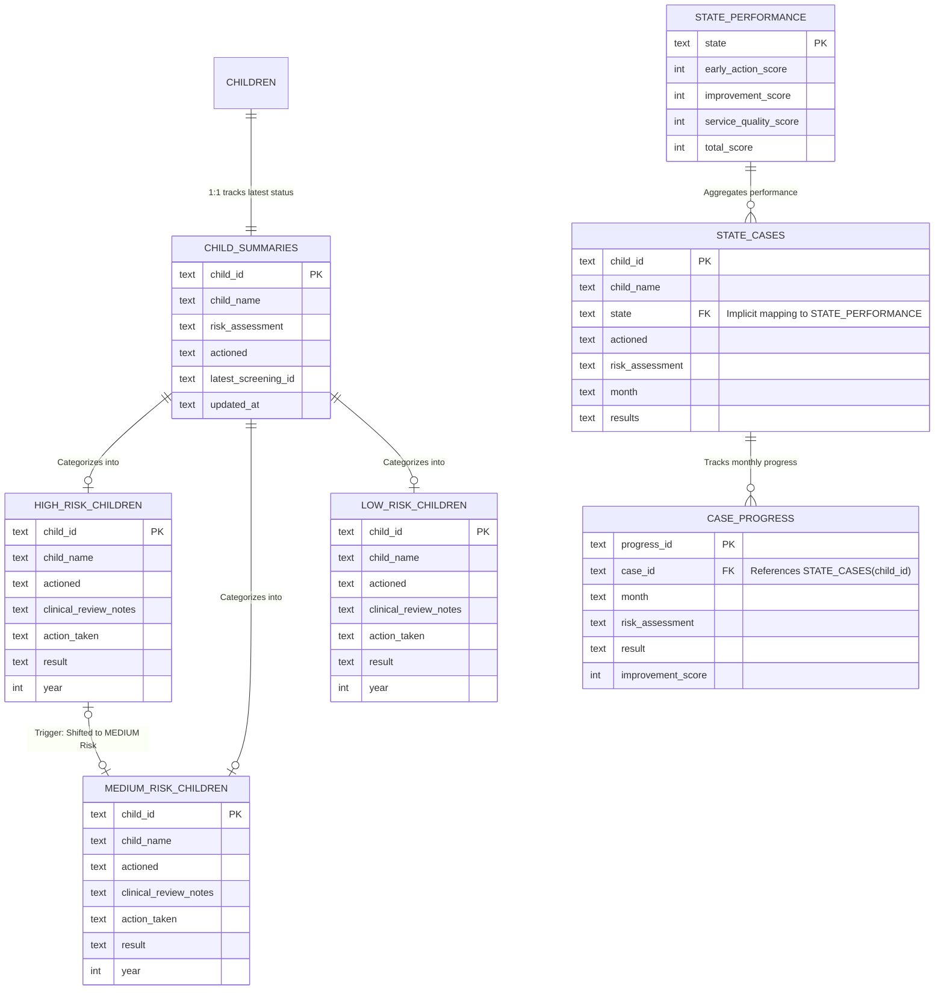

# Database ER Diagram (Autism Screening System Segregation)

Here is the Entity-Relationship Diagram detailing the tables we created and modified over the last few hours to segregate risk data and track state-wise progression.

### Table Breakdown

1. **`child_summaries`**: The single source of truth summarizing the latest screening status for every child, preventing duplicate records.
2. **`high_risk_children`, `medium_risk_children`, `low_risk_children`**: Three completely isolated tables strictly for categorizing children by their risk level natively in PostgreSQL. Includes a Postgres Trigger that automatically copies a child from the High Risk table to the Medium Risk table if their result changes to "Shifted to MEDIUM risk".
3. **`state_cases`**: The base table for the advanced state-tracking module, capturing the "final" or "latest" monthly status of a child organized by their geographical state.
4. **`case_progress`**: A child table to `state_cases` linked by `case_id`. It stores the exact month-by-month historical timeline (February, March, April) for each individual child.
5. **`state_performance`**: An aggregated table acting as the overall leaderboard, containing the heavily calculated Early Action, Improvement, and Service Quality scores.
